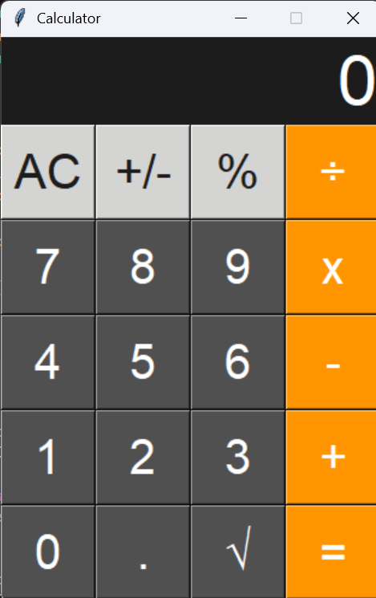

# Simple Calculator

A simple calculator built with Python and Tkinter. It performs basic arithmetic operations through a clean graphical interface, styled after the iOS calculator.

## Features

- Addition, subtraction, multiplication, and division
- Square root and percentage functions
- Positive/negative toggle (+/-)
- Clear (AC) function
- Simple, easy-to-use button interface

## Technologies used

- Python 3
- Tkinter (GUI library)

## How to run

1. Clone this repository
```bash
   git clone https://github.com/malaknajah191-blip/Calculator.git
```
2. Navigate to the project folder
```bash
   cd Calculator
```
3. Run the program
```bash
   python calculator.py
```

No external libraries are required, Tkinter comes built-in with Python.
## Screenshot



## What I learned

This project helped me practice:
- Building GUIs in Python with Tkinter
- Handling button events and user input
- Structuring a small standalone application

## Author

Built by Malak Najah as a personal practice project.